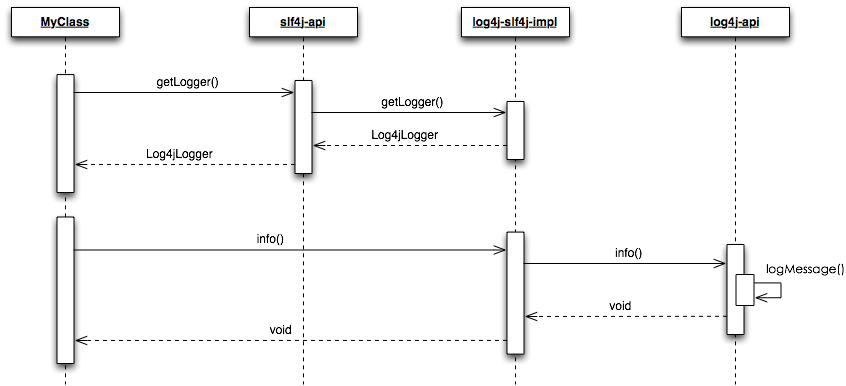
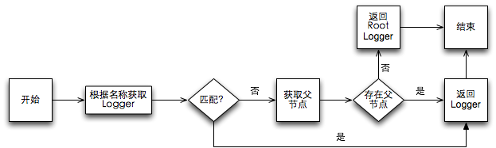
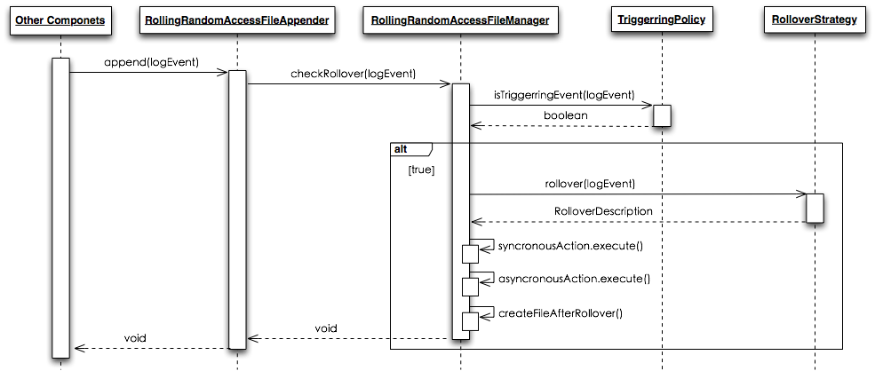
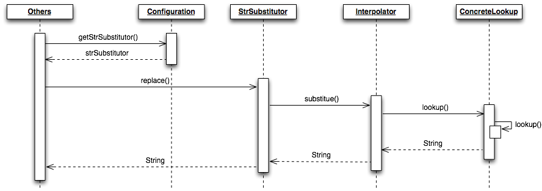

# 一、快速入门

**maven 依赖**：

```xml
<dependency>
    <groupId>org.apache.logging.log4j</groupId>
    <artifactId>log4j-api</artifactId>
    <version>2.5</version>
</dependency>
<dependency>
    <groupId>org.apache.logging.log4j</groupId>
    <artifactId>log4j-core</artifactId>
    <version>2.5</version>
</dependency>
<dependency>
    <groupId>org.apache.logging.log4j</groupId>
    <artifactId>log4j-web</artifactId>
    <version>2.5</version>
    <scope>runtime</scope>
</dependency>
<dependency>
    <groupId>org.slf4j</groupId>
    <artifactId>slf4j-api</artifactId>
    <version>1.7.13</version>
</dependency>
<dependency>
    <groupId>org.apache.logging.log4j</groupId>
    <artifactId>log4j-slf4j-impl</artifactId>
    <version>2.5</version>
</dependency>
```

**log4j2.xml 配置文件**：

```xml
<?xml version="1.0" encoding="UTF-8"?>
<Configuration status="WARN" monitorInterval="60">
    <Appenders>
        <Console name="Console" target="SYSTEM_OUT"> <!-- 定义类型为Console的Appender -->
            <!-- 定义类型为Pattern的Layout -->
            <PatternLayout pattern="%d{HH:mm:ss.SSS} [%level] %c{1} - %msg%n"/> 
        </Console>
    </Appenders>
    <Loggers>
        <Root level="error"> <!-- 定义Root Logger，其日志级别为error -->
            <AppenderRef ref="Console"/> <!-- Root Logger的Appender引用上面定义的Console -->
        </Root>
        <!-- 定义名字为HelloWorld的Logger，其日志级别为info，additivity为false -->
        <Logger name="HelloWorld" level="info" additivity="false"> 
            <AppenderRef ref="Console"/> <!-- Root Logger的Appender引用上面定义的Console -->
        </Logger>
    </Loggers>
</Configuration>
```

**打印日志**： 

```java
import org.slf4j.Logger;
import org.slf4j.LoggerFactory;
 
public class MyClass {
    /* 获取名字为HelloWorld的Logger，若无该Logger，则根据继承结构向父节点寻找，直到找到Root Logger为止 */
    private static final Logger HELLO_LOGGER = LoggerFactory.getLogger("HelloWorld"); 
    public void method() {
        HELLO_LOGGER.info("Hello World!"); // 打印日志信息
    }
}
```

# 二、基础结构

**slf4j 作为日志API，log4j2 作为日志实现**，时序图表示该过程：




**寻找 Logger 的过程**：




# 三、xml 标签

## 1、Appender

**Appenders**：负责**将日志事件发送到目的地**的组件

- Log4j2 中，Logger 和 Appender 是多对多的关系
- Appenders 可以将日志事件发送到多个目的地中，包括console、文件、远程Socket服务器、Flume、JMS、数据库等

### (1) ConsoleAppender

作用： ConsoleAppender **将日志事件输出到控制台上**

```xml
<?xml version="1.0" encoding="UTF-8"?>
<Configuration status="warn" name="MyApp" packages="">
  <Appenders>
    <!-- ConsoleAppender -->
    <Console name="STDOUT" target="SYSTEM_OUT">
      <PatternLayout pattern="%m%n"/>
    </Console>
  </Appenders>
  <Loggers>
    <Root level="error">
      <AppenderRef ref="STDOUT"/>
    </Root>
  </Loggers>
</Configuration>
```

详见：[ConsoleAppender 官方文档](http://logging.apache.org/log4j/2.x/manual/appenders.html#ConsoleAppender) 

### (2) RollingRandomAccessFileAppender

RollingRandomAccessFileAppender 结合了 RandomAccessFileAppender 和 RollingFileAppender 的特点

- 可以根据配置的 TriggeringPolicy 和 RolloverStrategy 决定何时以何种方式滚动文件(rolling file)
- 内部采用 ByteBuffer+RandomAccessFile 的方式，大大提高了写入文件的效率

```xml
<?xml version="1.0" encoding="UTF-8"?>
<Configuration status="WARN" monitorInterval="60">
    <Properties>
        <Property name="LOG_DIR">/opt/logs/gct/log4j2-web-test/</Property>
        <Property name="PATTERN">[%-5level] %d{yyyy-MM-dd HH:mm:ss.SSS} [%level] %c{1} - %msg%n</Property>
    </Properties>
    <Appenders>
      	<!-- RollingRandomAccessFile -->
        <RollingRandomAccessFile name="ErrorAppender" fileName="${LOG_DIR}/error.log" 
                                 filePattern="${LOG_DIR}/error-%d{yyyy-MM-dd}.log.gz">
            <PatternLayout pattern="${PATTERN}" />
            <Policies>
                <TimeBasedTriggeringPolicy interval="1" modulate="true" />
                <!-- 若log4j为2.5版本，推荐使用该方式，表示每日0点触发rollover动作 -->
                <CronTriggeringPolicy schedule="0 0 0 * * ?"/> 
            </Policies>
        </RollingRandomAccessFile>
    </Appenders>
    <Loggers>
        <Root level="error">
            <AppenderRef ref="error"/>
        </Root>
        <Logger name="Error" level="error" additivity="false">
            <AppenderRef ref="ErrorAppender"/>
        </Logger>
    </Loggers>
</Configuration>
```

- RollingRandomAccessFileAppender详见：[RollingRandomAccessFileAppender](http://logging.apache.org/log4j/2.x/manual/appenders.html#RollingRandomAccessFileAppender) 
- Triggering Policies详见：[TriggeringPolicies](http://logging.apache.org/log4j/2.x/manual/appenders.html#TriggeringPolicies) 
- Rollover Strategies详见：[RolloverStrategies](http://logging.apache.org/log4j/2.x/manual/appenders.html#RolloverStrategies) 



## 2、Layout

- 每个 Appender 对应一个 Layout，当 Appender 调用其所对应的 Layout 格式化 LogEvents 时，Layout 返回的是Bytes而不是String（详见：[Logback Encoders](http://logback.qos.ch/manual/encoders.html)）

### (1) PatternLayout

- PatternLayout 是通过 string 定义 pattern，其 pattern 类似 C 函数的 printf 函数，示例如下：

  ```txt
  [%-5level] %d{yyyy-MM-dd HH:mm:ss.SSS} [%level] %c{1} - %msg%n
  ```

- **pattern** 样式都是以 `%` 开头

  > 除 pattern 字段，PatternLayout 参数有：charset、replace、alwaysWriteExceptions、header、footer和noConsoleNoAnsi

关于 PatternLayout，详见：[PatternLayout](http://logging.apache.org/log4j/2.x/manual/layouts.html#PatternLayout)，其它 Layout 详见：[Layouts](http://logging.apache.org/log4j/2.x/manual/layouts.html) 

## 3、Configuration

```xml
<?xml version="1.0" encoding="UTF-8"?>
<Configuration status="WARN">
  <Filters>
    <Marker marker="EVENT" onMatch="ACCEPT" onMismatch="NEUTRAL"/>
    <DynamicThresholdFilter key="loginId" defaultThreshold="ERROR" onMatch="ACCEPT" onMismatch="NEUTRAL">
      <KeyValuePair key="User1" value="DEBUG"/>
    </DynamicThresholdFilter>
  </Filters>
  
  <Appenders>
    <Console name="Console" target="SYSTEM_OUT">
      <PatternLayout pattern="%d{HH:mm:ss.SSS} [%t] %-5level %logger{36} - %msg%n"/>
    </Console>
  </Appenders>
  
  <Loggers>
    <Logger name="com.foo.Bar" level="trace" additivity="false">
      <AppenderRef ref="Console"/>
    </Logger>
    <Root level="error">
      <AppenderRef ref="Console"/>
    </Root>
  </Loggers>
</Configuration>
```

**Configuration 特性**：

- Configuration 代表 Log4j2 配置文件，与 LoggerContext 组件一一对应，对应多个 LoggerConfig 组件
-  Configuration 的四种方式配置：
  1. 配置文件(XML、JSON、YAML)
  2. 创建 ConfigurationFactory 和 Configuration 实现
  3. 通过代码调用 Configuration 的 API 构造
  4. 在 Logger 内部调用 API 函数构造
- Configuration 能在应用程序初始化的过程中进行自动装配，其配置内容按照一定的顺序获取，详见：[AutomaticConfiguration](http://logging.apache.org/log4j/2.x/manual/configuration.html#AutomaticConfiguration) 
- 当给 Configuration 设置 monitorInterval 时，可以使 log4j2 阶段性的读取配置文件，并重新构造 Configuration

### (1) Configuration标签

```xml
<Configuration status="WARN">
  ...
</Configuration>
```

`status="WARN"` 说明：log4j2 内部的日志会将日志级别大于 WARN 的日志打印到 Console

> Configuration 还包括其他属性，详见：[ConfigurationSyntax](http://logging.apache.org/log4j/2.x/manual/configuration.html#ConfigurationSyntax) 

### (2) Appenders标签

```xml
<Appenders>
    <Console name="Console" target="SYSTEM_OUT">
      <PatternLayout pattern="%d{HH:mm:ss.SSS} [%t] %-5level %logger{36} - %msg%n"/>
    </Console>
</Appenders>
```

所有的 Appender 将在 `<Appenders>` 和 `</Appenders>` 之间定义

### (3) Logger标签

```xml
<Loggers>
    <Logger name="com.foo.Bar" level="trace" additivity="false">
      <AppenderRef ref="Console"/>
    </Logger>
    <Root level="error">
      <AppenderRef ref="Console"/>
    </Root>
</Loggers>
```

- `<Root>`：定义了所有 Logger 的根结点(RootLogger)，并通过` <AppenderRef>` 关联名称为“Console”的 Appender

- `additivity` 字段：规定是否将日志事件传递到 Logger 的父结点处理(**默认值为true**)

### (4) Filters标签

```xml
<Filters>
    <Marker marker="EVENT" onMatch="ACCEPT" onMismatch="NEUTRAL"/>
    <DynamicThresholdFilter key="loginId" defaultThreshold="ERROR" onMatch="ACCEPT" onMismatch="NEUTRAL">
        <KeyValuePair key="User1" value="DEBUG"/>
    </DynamicThresholdFilter>
</Filters>
```

- Filter 包括 `MarkerFilter` 和 `DynamicThresholdFilter`
- `onMatch` 和 `onMismatch` 表示经过 Filter 过滤后的结果，该结果有三个取值：`ACCEPT、NEUTRAL、DENY`

log4j2 在处理 LogEvents时，会通过该 Filter 进行过滤：

- 若返回结果为 `ACCEPT`，则直接处理（略过其它Filter和日志级别的过滤）
- 若返回 `DENY`，则直接终止该 LogEvents
- 若返回 `NEUTRAL`，则不做决策，让后续代码做处理

> 此处，Filter 是通过 Configuration 的直接子元素配置，因此，LogEvents 若被该 Filter 过滤之后则不会传递给 Logger 处理

---

**Filter 组件**： 返回值为 `ACCEPT、NEUTRAL、DENY`，详见：[Filters](http://logging.apache.org/log4j/2.x/manual/filters.html) 

在配置文件中，Filter 可以在四个地方声明：

- **Configuration** 标签直接子元素
- **Logger** 标签直接子元素
- **Appender** 标签直接子元素
- **AppenderRef** 标签直接子元素

---

**以 MarkerFilter 为例说明 Filter 的使用**：

- 根据配置文件得知HELLO_LOGGER为Root Logger

- 打印日志时，RootLogger 配置的 MarkerFilter 匹配日志事件的 Marker（名称都为FLOW），因此属于 onMatch

- 根据配置文件得知 onMatch 对应于 DENY，因此，该日志事件被 MarkerFilter 过滤掉，不予打印

配置文件：

```xml
<?xml version="1.0" encoding="UTF-8"?>
<Configuration status="warn" name="MyApp" packages="">
  <Appenders>
    <Console name="STDOUT" target="SYSTEM_OUT">
      <PatternLayout pattern="%m%n"/>
    </Console>
  </Appenders>
  <Loggers>
    <Root level="error">
      <MarkerFilter marker="FLOW" onMatch="DENY" onMismatch="ACCEPT"/>
      <AppenderRef ref="STDOUT"/>
    </Root>
  </Loggers>
</Configuration>
```

调用代码： 

```java
import org.slf4j.Logger;
import org.slf4j.LoggerFactory;
import org.slf4j.Marker;
import org.slf4j.MarkerFactory;
 
public class MyClass {
    /* 获取名字为HelloWorld的Logger，若无该Logger，则根据继承结构向父节点寻找，直到找到Root Logger为止 */
    private static final Logger HELLO_LOGGER = LoggerFactory.getLogger("HelloWorld"); 
    private static final Marker marker = MarkerFactory.getMarker("FLOW");
    public void method() {
        HELLO_LOGGER.info(marker, "Hello World!"); // 打印日志信息
    }
}
```

## 4、LoggerContext

- Web 项目存在多个应用程序共用同一个应用环境的情况，而每个应用都需要自己的日志环境。因此，LoggerContext 组件解决该问题，使得不同的应用程序可以使用不同的 LoggerContext 完成日志行为

  > - 引入 log4j-web，在 web 程序启动时，会调用 `org.apache.logging.log4j.core.config.Configurator.initialize()` 函数初始化 LoggerContext
  > - 在初始化 LoggerContext 的过程中，log4j2 会读取配置文件并初始化 Configuration，接着将 LoggerContext 与Configuration 绑定
  > - LoggerContext 维护 Logger 集合，只有在第一次使用 Logger 时，才将其以 key/value(name->Logger) 的形式加入Map

- 一个 LoggerContext 对应一个 Configuration 和多个 Logger


# 四、插件

## 1、Lookups

Lookups 使得可以在 Log4j2 的配置文件中使用一些增加一些变量值，如上下文信息、系统属性、环境变量等，详见：[Lookups](http://logging.apache.org/log4j/2.x/manual/lookups.html) 

- 配置文件：

  ```xml
  <!-- 可以在配置文件中使用${name}或${name:key}实现相应的lookup -->
  <Appenders>
    <File name="Application1" fileName="application.log">
      <PatternLayout>
        <pattern>%d %p %c{1.} [%t] $${ctx:loginId} %m%n</pattern>
      </PatternLayout>
    </File>
    <File name="Application2" fileName="application.log">
      <PatternLayout>
        <pattern>%d %p %c{1.} [%t] $${env:USER} %m%n</pattern>
      </PatternLayout>
    </File>
    <File name="ApplicationLog" fileName="${sys:logPath}/app.log"/>
  </Appenders>
  ```

- Lookups支持嵌套替换，注意：假设 `${name}` 的值为 `x`，`${x}` 的值为 `y`，则`${${name}}` 将会被替换为 `y`；若要实现`${y}`，应使用` $${${name}}`，这是因为`$` 为转义符号

  例如：

  ```java
  Map<String, String> map = new HashMap<String, String>();
  map.put("name", "Routh");
  map.put("Routh", "luosi02@meituan.com");
  String t1 = "${name} can help you.";
  String t2 = "Who is Routh? Ask him by sending email to ${${name}}.";
  String t3 = "Wow, how do u know his email? Er... You can get it by $${${name}}!";
  StrSubstitutor substitutor = new StrSubstitutor(map);
  substitutor.setEnableSubstitutionInVariables(true);
  Log4jLogEvent event = new Log4jLogEvent();
  System.out.println(substitutor.replace(event, t1));
  System.out.println(substitutor.replace(event, t2));
  System.out.println(substitutor.replace(event, t3));
   
  /* Output: */
  // Routh can help you.
  // Who is Routh? Ask him by sending email to luosi02@meituan.com.
  // Wow, how do u know his email? Er... You can get it by ${Routh}!
  ```

---

 Log4j2 实现中，有一些 property 的替换操作在解析配置文件时进行，而另外一些 property 是在运行时动态替换

每个具体的 Lookup 都必须使用 `@Plugin` 注解(name 为该 Lookup 的名称，category 必须为 StrLookup.CATEGORY)，而且必须实现StrLookup 接口，如下：

```java
@Plugin(name = "myLookupName", category = StrLookup.CATEGORY)
public class MyLookup implements StrLookup {
    @Override
    public String lookup(String key) {
        return doLookup(null, key);
    }
    @Override
    public String lookup(LogEvent event, String key) {
        return doLookup(event, key);
    }
  
    private String doLookup(LogEvent event, String key) {
        if (event == null) {
            /* lookup with key */
        } else {
            /* lookup with event and key */
        }
    }
}
```

`StrLookup` 有两个 lookup 函数：

1. 参数为 `key`：直接返回其对应的值，如 SystemPropertiesLookup
2. 参数为 `LogEvent` 和 `key`：根据 event 和 key 返回相应的值，如 ContextMapLookup

在 Log4j2 中的大致流程为：



- 关于StrLookup，详见：[strLookup](http://logging.apache.org/log4j/2.x/log4j-core/apidocs/org/apache/logging/log4j/core/lookup/StrLookup.html) 

- 关于StrSubstitutor，详见：[strSubstitutor](https://logging.apache.org/log4j/2.0/log4j-core/apidocs/org/apache/logging/log4j/core/lookup/StrSubstitutor.html) 

## 2、自定义插件

只需给类加上 [@Plugin](http://logging.apache.org/log4j/2.x/log4j-core/apidocs/org/apache/logging/log4j/core/config/plugins/Plugin.html) 注解，即可将类声明为插件，在 Log4j2 初始化配置文件时，会调用 `PluginManager` 加载所有的插件，包括内置的插件和自定义插件

PluginManager 会通过以下步骤加载插件：

- 扫描 classpath 包含的插件列表文件(这些文件是在 build 时自动生成)
- (只适用OSGi)扫描 OSGi bundle 包含的插件列表文件
- 扫描通过 `log4j.plugin.packages` 系统变量指定的包(多个包适用逗号分隔)
- 扫描通过静态方法 `PluginManager.addPackages` 添加的包
- 扫描配置文件中指定的包

> 在 Log4j2 中，**大部分组件以插件的形式实**现：
>
> - 核心插件(Core)**Appender、Logger、Filter、Layout**等，都必须声明一个 static 方法，并使用 PluginFactory 注解
> - 该方法的参数都必须使用注解：`PluginAttribute、PluginElement、PluginConfiguration、PluginNode、Required`，使得Configuration 在解析配置文件时，可以直接通过该 static 方法传入参数并创建相应的组件

```java
@Plugin(name = "SampleLayout", category = "Core", elementType = "layout", printObject = true)
public class SampleLayout extends AbstractStringLayout {
 
    protected SampleLayout(boolean locationInfo, boolean properties, boolean complete, Charset charset) {
    }
 
    @PluginFactory
    public static SampleLayout createLayout(@PluginAttribute("locationInfo") boolean locationInfo,
                               							@PluginAttribute("properties") boolean properties,
                               							@PluginAttribute("complete") boolean complete,
                     @PluginAttribute(value = "charset", defaultStringValue = "UTF-8") Charset charset) {
        return new SampleLayout(locationInfo, properties, complete, charset);
    }
}
```

详见： [Plugins](http://logging.apache.org/log4j/2.x/manual/plugins.html) 

# 五、异步 Log

## 1、简介

异步 Logger 通过不同线程实现 I/O 操作，目的在于为我们的应用程序提高性能，改进方面：

1. `Asynchronous Loggers`： 异步日志器的目的是让应用程序在调用 Logger.log() 打印日志时立马返回
   - 异步日志器： 给程序带来很大的性能提升
   - 混合日志器，让程序足够灵活
2. `LMAX Disruptor` 技术：异步日志器的内部采用了 Disruptor 技术，相对于 BlockingQueue，提高了吞吐量和降低延时
3. `Asynchronous Appender`： 使得每次写入磁盘时，都会进行 flush 操作，等同配置 `immediateFlush=true`，内部采用`ArrayBlockingQueue`，因此不需要引入 disruptor 依赖
4. `RandomAccessFileAppender`： 采用 `ByteBuffer+RandomAccessFile` 替代 `BufferedOutputStream` 

> 要根据具体的应用场景决定使用同步还是异步方式，详见：[Trade-offs](http://logging.apache.org/log4j/2.x/manual/async.html#Trade-offs) 

## 2、异步模式

1. **引入 disruptor 依赖**： 

   ```xml
   <dependency>
       <groupId>com.lmax</groupId>
       <artifactId>disruptor</artifactId>
       <version>3.3.2</version>
   </dependency>
   ```

2. **设置系统属性**： 

   ```shell
   -DLog4jContextSelector=org.apache.logging.log4j.core.async.AsyncLoggerContextSelector
   ```

3. **配置文件**：

    ```xml
   <?xml version="1.0" encoding="UTF-8"?>
   <Configuration status="WARN">
     <Appenders>
       <!-- Async Loggers will auto-flush in batches, so switch off immediateFlush. -->
       <RandomAccessFile name="RandomAccessFile" fileName="async.log" 
                         immediateFlush="false" append="false">
         <PatternLayout>
           <Pattern>%d %p %c{1.} [%t] %m %ex%n</Pattern>
         </PatternLayout>
       </RandomAccessFile>
     </Appenders>
     <Loggers>
       <Root level="info" includeLocation="false">
         <AppenderRef ref="RandomAccessFile"/>
       </Root>
     </Loggers>
   </Configuration>
    ```

**注意**：

1. 上述配置文件不需要 `location` 信息：异步模式下，Logger 默认不会获取 location 信息(但**需要 location 信息**)，因此设置 `includeLocation=true`，RootLogger 也一样

2. 设置 `AsyncLoggerContextSelector` 之后，所有 Logger 默认采用异步方式

   > 若在配置文件中使用 `<asyncRoot>`或 `<asyncLogger>`，则 Log4j2 会创建两个后台线程A和B，应用程序将日志传递至A，A再将其传递至B，最后线程B再写入磁盘
   >
   > - 缺点： 增加了不必要的开销
   > - `<asyncRoot>` 或 `<asyncLogger>` 目的：在于配置混合模式的 Logger

3. 可以配置系统属性以调整异步 Logger 的性能，详见：[Asynchronous](http://logging.apache.org/log4j/2.x/manual/async.html#AllAsync) 

## 3、混合模式

- **引入 disruptor 依赖**：

  ```xml
  <dependency>
      <groupId>com.lmax</groupId>
      <artifactId>disruptor</artifactId>
      <version>3.3.2</version>
  </dependency>
  ```

- **编写配置文件**：

  ```xml
  <?xml version="1.0" encoding="UTF-8"?>
  <Configuration status="WARN">
    <Appenders>
      <!-- Async Loggers will auto-flush in batches, so switch off immediateFlush. -->
      <RandomAccessFile name="RandomAccessFile" fileName="asyncWithLocation.log"
                immediateFlush="false" append="false">
        <PatternLayout>
          <Pattern>%d %p %class{1.} [%t] %location %m %ex%n</Pattern>
        </PatternLayout>
      </RandomAccessFile>
    </Appenders>
    <Loggers>
      <!-- pattern layout actually uses location, so we need to include it -->
      <AsyncLogger name="com.foo.Bar" level="trace" includeLocation="true">
        <AppenderRef ref="RandomAccessFile"/>
      </AsyncLogger>
      <Root level="info" includeLocation="true">
        <AppenderRef ref="RandomAccessFile"/>
      </Root>
    </Loggers>
  </Configuration>
  ```

**说明**：

1. 混合模式即配置文件中既包括同步 Logger 又包括异步 Logger，其中AsyncLogger 和 AsyncRoot 为异步Logger，其他为同步Logger
2. 混合模式**不需要**设置系统变量 AsyncLoggerContextSelector
3. 与异步模式一样，必须给相应的AsyncLogger设置 `includeLocation=true`，AsyncRoot 也一样
4. 可以配置系统属性以调整异步 Logger 的性能，详见：[Mixing Synchronous and Asynchronous Loggers](http://logging.apache.org/log4j/2.x/manual/async.html#MixedSync-Async) 